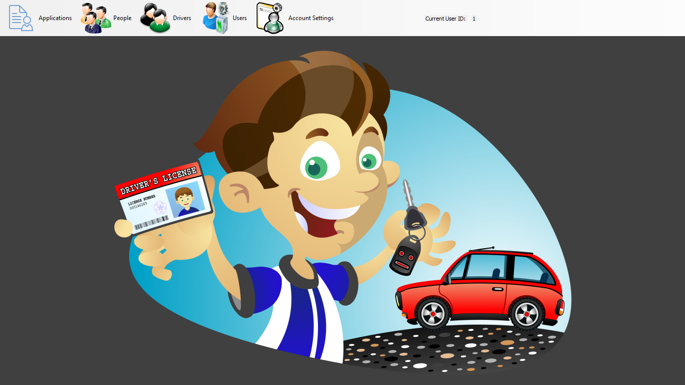
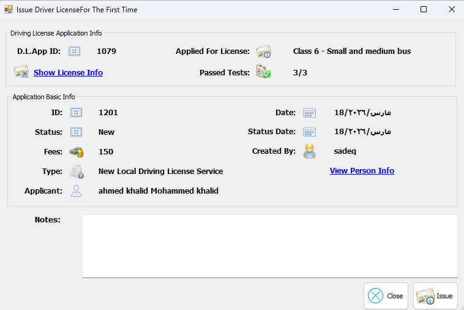
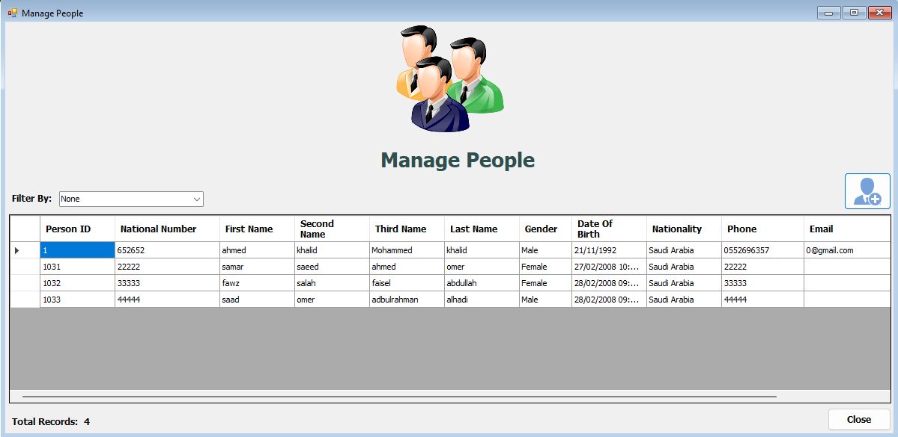

# 🚗 DVLD — Driving & Vehicle License Department System

> A comprehensive desktop application for managing driving licenses, applicants, and related services — built to simulate a real-world government licensing department.

---

## 📋 Table of Contents

- [Overview](#overview)
- [Features](#features)
- [License Classes](#license-classes)
- [Services](#services)
- [System Administration](#system-administration)
- [Database Schema Highlights](#database-schema-highlights)
- [Tech Stack](#tech-stack)
- [Getting Started](#getting-started)
- [Screenshots](#screenshots)
- [License](#license)

---

## Overview

The **DVLD System** is a full-featured management platform for a Driving & Vehicle License Department. It handles everything from issuing first-time licenses to renewing, replacing, and internationally extending driving permits — while enforcing age requirements, test prerequisites, and license validity rules.

---

## Features

### 🪪 Core Services
| # | Service | Fee |
|---|---------|-----|
| 1 | Issue First-Time License | $5 (application) + class fee |
| 2 | Re-Schedule a Failed Test | $5 + test fee |
| 3 | Renew Driving License | $10 |
| 4 | Replace Lost License | $20 |
| 5 | Replace Damaged License | $20 |
| 6 | Release Detained License | Varies (fine applies) |
| 7 | Issue International License | $20 |

### 🧪 Testing Pipeline (for First-Time Issuance)
All applicants must pass **three sequential tests** in order:

1. **Vision Test** — $10 fee. Failure requires rescheduling after vision correction.
2. **Theoretical (Written) Test** — $20 fee. Scored out of 100. Failure allows retake with fee.
3. **Practical Driving Test** — Fee varies by license class. Failure allows retake with fee.

### 🔐 Business Rules Enforced
- Applicants must meet the **minimum age** requirement per license class.
- A person **cannot hold two licenses of the same class**.
- A person **can hold licenses across multiple classes** (e.g., motorcycle + car).
- Applications of the same type cannot be duplicated if one is still active/pending.
- Detaining or releasing a license is fully tracked with date, reason, and fine.
- International licenses require a **valid, non-detained Class 3** local license.
- If an active international license exists, it is **automatically cancelled** upon issuing a new one.

---

## License Classes

| Class | Description | Min Age | Validity | Fee |
|-------|-------------|---------|----------|-----|
| 1 | Small Motorcycles | 18 | 5 years | $15 |
| 2 | Heavy Motorcycles | 21 | 5 years | $30 |
| 3 | Regular Car (Personal) | 18 | 10 years | $20 |
| 4 | Commercial (Taxi/Limo) | 21 | 10 years | $200 |
| 5 | Agricultural Vehicles | 21 | 10 years | $50 |
| 6 | Small/Medium Buses | 21 | 10 years | $250 |
| 7 | Trucks & Heavy Vehicles | 21 | 10 years | $300 |

---

## Services — Detailed Flow

### 1. First-Time License Issuance
- Applicant submits application → pays $5 fee.
- System validates: age eligibility, no duplicate class license exists.
- Applicant completes Vision → Theory → Practical tests in order.
- On success: license is issued with full details (number, photo, NID, name, DOB, class, issue date, expiry date, notes, issue type = **New**).
- Applicant is registered as an **official driver** in the system.

### 2. Re-Test Scheduling
- Linked to a previous failed test via its test ID.
- One pending appointment per test type — no duplicates allowed.
- Triggers a new application record linked to the original.

### 3. License Renewal
- Requires passing a new **Vision Test**.
- Old/expired license must be surrendered first.

### 4. Lost License Replacement
- License must **not** be detained.
- Old record is marked; new license issued with type = **Replacement (Lost)**.

### 5. Damaged License Replacement
- Damaged license must be physically surrendered.
- New license issued with type = **Replacement (Damaged)**.

### 6. Detain / Release License
- Detention records: license number, reason, fine amount, detention date.
- Release records: fine payment confirmation, release date.

### 7. International License
- Only available to valid **Class 3** license holders.
- License must be **active** and **not detained**.
- Duration is configurable in system settings.
- Previous international licenses are cancelled automatically; history is preserved.

---

## System Administration

| Module | Capabilities |
|--------|-------------|
| **Users** | Add, view, edit, delete, freeze accounts; assign permissions; link to a person record |
| **People** | Add, view, edit, delete; search by National ID; no duplicates allowed |
| **Applications** | Search by ID or National ID; filter by status (New / Cancelled / Completed); view fees |
| **Test Types** | View; edit fees only |
| **License Classes** | View; edit minimum age, validity period, and fees |
| **License Detention** | Detain a license with reason, fine, and date |

> 📝 **Audit Trail:** Every action in the system records the **user who performed it** and the **timestamp**.

---

## Database Schema Highlights

```
People          — Personal info (NID, full name, DOB, address, phone, email, nationality, photo)
Users           — System accounts linked to People records (username, password, permissions)
LicenseClasses  — 7 predefined classes (editable: min age, validity, fees)
Applications    — All service requests (linked to Person; tracks type, status, fees paid)
Tests           — Appointments per test type (linked to Application; tracks result, score, date)
Licenses        — Issued licenses (linked to Driver; tracks class, issue date, expiry, issue type)
Drivers         — Registered drivers (created upon first license issuance; unique per person)
Detentions      — License detention records (reason, fine, dates)
InternationalLicenses — Issued international licenses (all historical records kept)
```

---

## Tech Stack

> _(Update this section to match your actual implementation)_

- **Language:** C# / .NET
- **UI Framework:** Windows Forms
- **Database:** SQL Server
- **Architecture:** N-Tier (Data Access Layer, Business Logic Layer, Presentation Layer)

---

## Getting Started

### Prerequisites
- Visual Studio 2019 or later
- SQL Server (Express or higher)
- .NET Framework 4.x

### Setup

1. **Clone the repository**
   ```bash
   git clone https://github.com/your-username/DVLD.git
   cd DVLD
   ```

2. **Set up the database**
   - Open SQL Server Management Studio.
   - Run the script located at `Database/DVLD_Schema.sql`.
   - (Optional) Run `Database/DVLD_Seed.sql` for sample data.

3. **Configure the connection string**
   - Open `App.config` (or `appsettings.json`).
   - Update the `ConnectionString` to point to your SQL Server instance.

4. **Build & Run**
   - Open `DVLD.sln` in Visual Studio.
   - Build the solution (`Ctrl + Shift + B`).
   - Run the application (`F5`).

### Default Login
```
Username: admin
Password: admin123
```
> ⚠️ Change the default credentials immediately after first login.

---

## Screenshots

> _(Add screenshots of your application here)_

| Dashboard | Issue License | Manage People |
|-----------|--------------|---------------|
|  |  |  |

---

## License

This project was developed as part of a software engineering course project.  
© 2023 [ProgrammingAdvices.com](https://programmingadvices.com) — All rights reserved.
